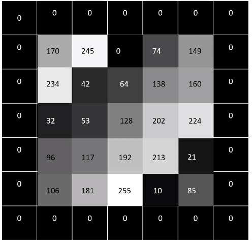

# Filtrado Ruido No-Trivial

Filtrado tradicional con convolución, simplemente es hacer la convolución del kernel con la imagen.

<p align="center">

</p>


<p align="center">

</p>

<p align="center">

</p>

## Filtro Blur

Problema con los borderes, elimina el ruido pero difumina la imagen.

```
import cv2
import numpy as np
from skimage import io, img_as_float
import matplotlib.pyplot as plt


img = cv2.imread('Images/lena_noise.jpg', 0)

kernel = np.ones((5,5), np.float32)/25 #Kernel normalizado
img_blur = cv2.filter2D(img, -1, kernel, borderType=cv2.BORDER_CONSTANT)

fig, axs = plt.subplots(nrows=2, sharex=True, figsize=(6, 8))
axs[0].set_title('Imagen con ruido')
axs[0].imshow(img, cmap='gray')

axs[1].set_title('Imagen filtrada')
axs[1].imshow(img_blur,  cmap='gray')
plt.show()

```

## Filtrado Bilateral 

## Filtrado Bilateral

Uno de los filtros para eliminar ruido (*denoising filter*) más usados. Este es un filtro preservador de bordes, y lo que hace es reemplazar el valor de cada pixel por el promedio de los píxeles cercanos (vecinos).

$$BF[I]_p = \frac{1}{W_p}\sum_{q\in S}G_{\sigma_s}(||p-q||)G_{\sigma_r}(||I_p-I_q||)I_q$$ 

Donde,

$$W_p = \sum_{q\in S}G_{\sigma_s}(||p-q||)G_{\sigma_r}(||I_p-I_q||)$$ 

Teniendo en cuenta que:
* $G_{\sigma_r}$ es el del núcleo (kernel) de rango para suavizar las diferencias en las intensidades, generalmente es una función Gaussiana.
* $G_{\sigma_s}$ es el del núcleo (kernel) espacial para suavizar las diferencias en las coordenadas, generalmente es una función Gaussiana. 
* $BF[I]_p$ es la imagen filtrada.
* $I_q$ corresponde a la imagen de entrada


Se combinan los dos filtros obteniendo un nuevo kernel que suavisa la señal eliminando el ruido.


<p align="center">

</p>
   
<p align="center">

</p>

### ¿Comó preserva los bordes?
Como se menciona el filtrado bilateral hace el filtrado gasussiano en el espacio, pero también hace otro filtrado Gaussiano de diferencia entre pixeles. En otras palabras, el primer filtro Gaussiano en el espacio hace que solo los pixeles cercanos sean considerados, mientras que el filtro Gaussiano de diferencia en intensidad hace que solo los pixeles con intensidades similares sean considerados. Esto resulta en la preservacion de los bordes, ya que estos tendrán una mayor variación de intensisdad y no se verán alterados.

```
import cv2
import numpy as np
from skimage import io, img_as_float
import matplotlib.pyplot as plt
```

```
img = cv2.imread('Images/lena_noise.jpg', 0)
plt.imshow(img, cmap='gray')
plt.gca().axes.yaxis.set_ticklabels([])
plt.gca().axes.xaxis.set_ticklabels([])
```

### Filtrado utilizando OpenCV

```
dst = cv.bilateralFilter(src, d, sigmaColor, sigmaSpace[, dst[, borderType]])
```

La señal de entrada debe ser de punto flotante o un 8-bits, de 1 o 3 canales.

* **d:** diametro de cada pixel vecino que se esta utilizando durante el filtrado. (Se puede ver como el tamaño del kernel).

* **sigmaColor:** Desviasión estandar para el filtro de intensidad.

* **sigmaSpace:** Desviasión estandar para el filtro de espacio.

* **borderType:** Forma de tratar los bordes, si se usará padding o si se recortará la imagen de salida

```
bilateral_using_cv2 = cv2.bilateralFilter(img,7, 20, 20, borderType=cv2.BORDER_CONSTANT)

fig, axs = plt.subplots(nrows=3, sharex=True, figsize=(10, 15))
axs[0].set_title('Imagen Original')
axs[0].imshow(img, cmap='gray')

axs[1].set_title('Filtrado Bilateral')
axs[1].imshow(bilateral_using_cv2, cmap='gray')

axs[2].set_title('Filtrado Blur')
axs[2].imshow(img_blur,  cmap='gray')
plt.show()
```

## Filtrado Non-Local Means

```
```

## Filtrad Homomórfico

```
```